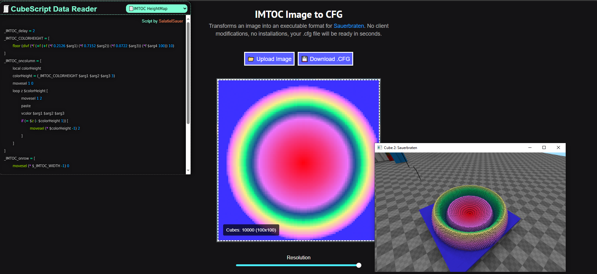
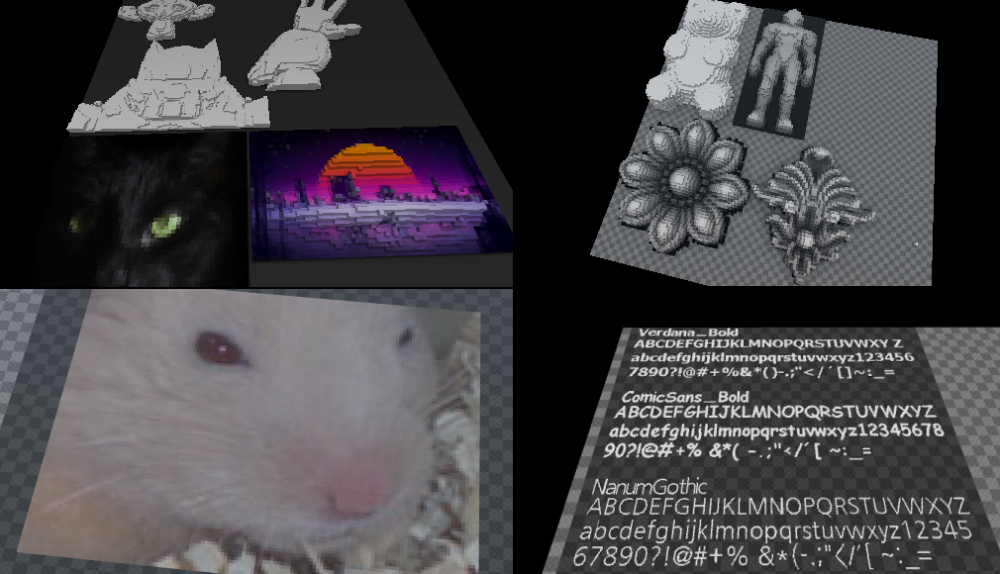

# IMTOC 3.0: Image to CFG

A simple web tool that saves the colors of an image in a CubeScript format supported by [Sauerbraten](http://sauerbraten.org), and includes functions to turn these colors into geometry within the game.

It's all pretty intuitive, but if you've never tried Sauer's edit mode, here's a step-by-step guide:

1. [Open the tool](https://salatielsauer.github.io/IMTOC-Converter/) and upload an image using the **Upload Image** button or by pasting it with `CTRL+V`.
2. Adjust the resolution (100x100 is recommended; larger sizes will take longer to draw in-game).
3. Download the `.CFG` file and place it in the root directory of your Sauerbraten installation (or the Sauerbraten home folder).
4. In game:
   - Open an empty map (/newmap).
   - Enter edit mode (`E` key).
   - Select a cube with your desired gridpower (`/gridpower 0` is recommended).
   - Copy the cube (`C` key in edit mode).
   - Execute the `.CFG` file with the `/exec` command.
   - Optionally, enable `/allfaces 1` to apply the color to all faces of the cube.

## Data Reader Editor

The page includes a text area that allows you to customize the CubeScript used to process the colors extracted from the image. 

The editor provides predefined data readers, variables and commands for ease of use:

### Variables

- **_IMTOC_delay**  
  Controls the sleep (delay) for drawing each pixel.
- **_IMTOC_DATA**  
  Contains the concatenated hexadecimal colors extracted from the image.
- **_IMTOC_PIXEL**  
  Contains the hexadecimal value of the current pixel.
- **_IMTOC_INDEX**  
  Tracks the index of the current character in the hexadecimal string (advances in steps of 6).
- **_IMTOC_WIDTH**  
  Holds the width of the current image.
- **_IMTOC_HEIGHT**  
  Holds the height of the current image.
- **_IMTOC_FILENAME**  
  Stores the original filename of the image.

### Events

You can use the following events (commands automatically executed at specific points):

- **_IMTOC_oncolumn**  
  Triggered for each column of the image (horizontally).
- **_IMTOC_onrow**  
  Triggered for each row of the image (vertically).
- **_IMTOC_onexec**  
  Triggered as soon as the `.CFG` file is executed using `/exec`.
- **_IMTOC_onend**  
  Triggered when the last pixel is drawn.

### Drawing Command

To trigger the drawing process, use:  `/_IMTOC_draw`

*IMTOC 3.0 by @SalatielSauer (2018-2024)*

Previous IMTOC:
[IMTOC 2.0 archive (collect-edition)](https://github.com/SalatielSauer/IMTOC-Converter/tree/collect-edition)